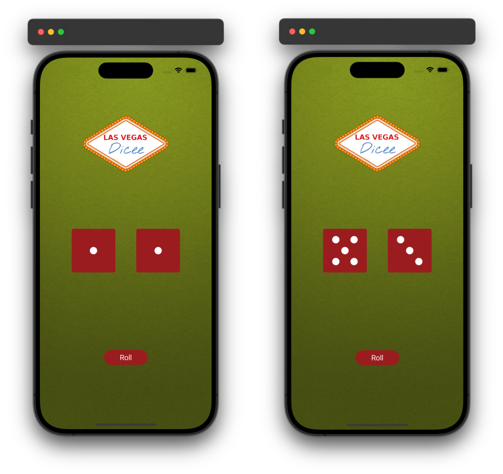

# Dicee

## Introduction
The Dicee app is a simple iOS application that simulates the rolling of two dice. With the press of a button, the app randomly selects and displays two dice faces, providing a fun and interactive experience for users. This app serves as a great example for beginners to learn about basic iOS development concepts such as `UIViewController`, `IBOutlet`, `IBAction`, and working with arrays and images.

### Preview

  

## Features
- **Random Dice Roll**: Simulates rolling of two dice with the press of a button.
- **Dynamic UI**: Updates the dice images dynamically each time the button is pressed.
- **Simple and Clean Design**: Easy-to-understand interface with minimalistic design.

## Code Structure
The app is structured around a single view controller (`ViewController`) which manages the user interface elements and handles user interactions. It utilizes outlets to connect to the dice image views (`diceImageView1` and `diceImageView2`) and an action method (`rollButtonPressed(_:)`) triggered by the roll button.

## Conclusion
Dicee is a straightforward iOS app that demonstrates how to implement basic functionalities like randomization and image manipulation using Swift and UIKit. It's ideal for learning the fundamentals of iOS app development and can be a starting point for more complex projects.